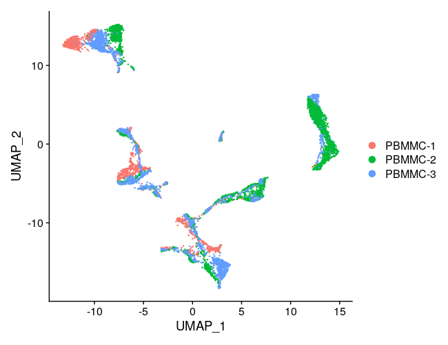

::: {.callout-caution}
## Looking for previous material?

Are you looking for material of previous versions of the course? Find it at [sib-swiss.github.io/single-cell-training-archived](https://sib-swiss.github.io/single-cell-training-archived)
:::

<figure>
    
</figure>

## Teachers

- Deepak Tanwar [ORCiD](https://orcid.org/0000-0001-8036-1989)
- Joana Carlevaro-Fita [ORCiD](https://orcid.org/0000-0002-1674-2055)
- Nikolai Püllen [ORCiD](https://orcid.org/0000-0002-9446-1670)

### Teachers of previous iterations
- Luciano Cascione [ORCiD](https://orcid.org/0000-0002-4606-0637)
- Andrea Rinaldi
- Tania Wyss [ORCiD](https://orcid.org/0000-0003-2641-0895)
- Rachel Marcone-Jeitziner [ORCiD](https://orcid.org/0000-0002-5711-8435)
- Alex Russell Lederer [ORCiD](https://orcid.org/0000-0001-6381-5088)
- Luciano Cascione [ORCiD](https://orcid.org/0000-0002-4606-0637)
- Geert van Geest [ORCiD](https://orcid.org/0000-0002-1561-078X)
- Patricia Palagi [ORCiD](https://orcid.org/0000-0001-9062-6303)

## Helper

- Geert van Geest [ORCiD](https://orcid.org/0000-0002-1561-078X)

### Helpers of previous iterations

- Serena Zambarbieri
- Cassandra Litchfield [ORCiD](https://orcid.org/0000-0001-9374-1681)

## Attribution

Parts of this course are inspired by the [Broad Institute Single Cell Workshop](https://broadinstitute.github.io/2019_scWorkshop/index.html), the [CRUK CI Introduction to single-cell RNA-seq data analysis course](https://bioinformatics-core-shared-training.github.io/UnivCambridge_ScRnaSeq_Nov2021/) and courses previously developed by Walid Gharib at SIB. 

## License & copyright

**License:** [CC BY 4.0](https://github.com/sib-swiss/single-cell-training/blob/master/LICENSE.md)

**Copyright:** [SIB Swiss Institute of Bioinformatics](https://www.sib.swiss/)

## Learning outcomes

### General learning outcomes

At the end of the course, participants will be able to:

- Distinguish advantages and pitfalls of scRNA-seq, including its applications in experimental design.
- Design their own scRNA-seq experiment, by using common technologies like 10X Genomics.
- Apply quality control (QC) measures and utilize analysis tools to preprocess scRNA-seq data.
- Apply normalization, scaling, dimensionality reduction, and integration and clustering on single-cell transcriptomics data techniques using `R`.
- Differentiate between cell annotation techniques to identify and characterize cell populations.
- Use differential gene expression analysis methods on single-cell transcriptomics data to gain biological insights.
- Select enrichment analysis methods appropriate to the biological question and data.
- Develop a single-cell transcriptomics data analysis workflow from raw count matrix to differential gene expression with peer support and light guidance.

### Learning outcomes explained

To reach the general learning outcomes above, we have set a number of smaller learning outcomes. Each chapter starts with these smaller learning outcomes. Use these at the start of a chapter to get an idea what you will learn. Use them also at the end of a chapter to evaluate whether you have learned what you were expected to learn.

## Learning experiences

To reach the learning outcomes we will use lectures, exercises, polls and group work. During exercises, you are free to discuss with other participants. During lectures, focus on the lecture only.

### Exercises

Each block has practical work involved. Some more than others. The practicals are subdivided into chapters, and we'll have a (short) discussion after each chapter. All answers to the practicals are incorporated, but they are hidden. Do the exercise first by yourself, before checking out the answer. If your answer is different from the answer in the practicals, try to figure out why they are different.
